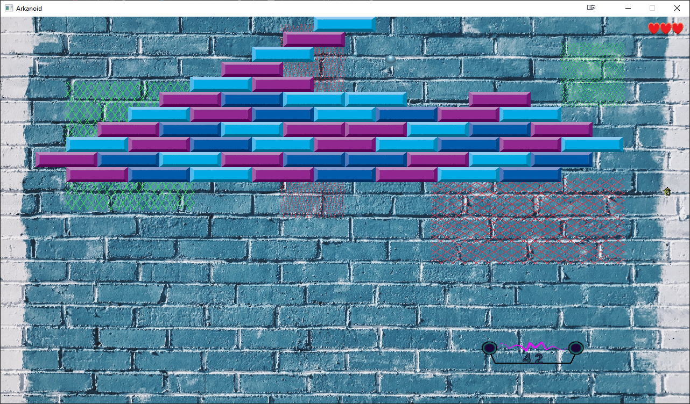

# Implementation of [Arkanoid](https://en.wikipedia.org/wiki/Arkanoid)-[like](https://www.youtube.com/watch?v=CS5y9CEUl2g) game in C++ using custom SDL2-based framework with some extra features:
  - The game window is divided into a few areas. The ball moves faster or slower by 50% in some areas.
  - Positive ability gives a “saving wall” and negative one damages the player. Saving wall appears on the bottom edge and deflects a ball if a player misses it. Disposable.
  - Positive ability increases the size of the platform and the negative one decreases it by 40%. Ability stays active for 20 seconds. Stackable. Minimum size is 50%, maximum is 200% of a default size.

Abilities cost 20 points. The player can buy an ability on the right mouse button. Points can be obtained by destroying blocks. A random ability is chosen and has an immediate impact.

# Running the app

An executable compiled for Win64 along with all the required dlls is available in [`release`](https://github.com/deonissv/arkanoid/releases) section
